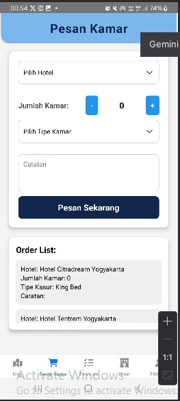

# Nama Produk: JogjaInn!

## Deskripsi Produk
*JogjaInn!* adalah aplikasi penginapan yang dirancang khusus untuk mempermudah wisatawan dalam mencari dan memesan hotel terbaik di Kota Yogyakarta. Dengan pilihan hotel yang beragam, mulai dari penginapan sederhana hingga hotel berbintang, aplikasi ini memberikan pengalaman menginap yang nyaman, praktis.

## Fitur utama
- **Map**: Fitur Peta interaktif yang menampilkan lokasi hotel-hotel di sekitar Yogyakarta. 
- **Pemesanan Kamar**: Fitur Pemesanan Kamar memudahkan pengguna untuk melakukan reservasi kamar hotel langsung melalui aplikasi.
- **List Hotel**: Fitur List Hotel menampilkan daftar hotel yang tersedia di Yogyakarta.
- **Edit Data Hotel**: Fitur Edit Data Hotel memungkinkan pengelola hotel untuk memperbarui informasi hotel

## Komponen Pembangun Produk
- **React Native**: Framework utama untuk membangun aplikasi mobile.
- **Metro Bundler**: JavaScript bundler bawaan React Native.
- **Node.js**: Mmengelola dependensi dan skrip aplikasi.
- **Android Studio & Xcode**: Emulator/simulator untuk pengujian aplikasi di Android dan iOS.
- **Backend/API**: Menggunakan RESTful API untuk pengelolaan data (opsional, sesuai dengan kebutuhan).

## Sumber Data
Aplikasi ini menggunakan data:
- Data hotel yang diunggah oleh pengguna.

## Tangkapan Layar Komponen Penting Produk
### Halaman Utama

### Halaman Input Data

### Halaman List Data

### Halaman Maps

### Halaman Edit Data

### Halaman Tentang

